## ТЗ: Что нужно сделать
1. Выявите конфиденциальные данные, которые не учтены во внутренних системах.
- Проанализируйте информацию о компании.
- Создайте диаграммы потоков данных (Data Flow Diagrams). Для каждого процесса создайте отдельную диаграмму.
- Отобразите на них, как данные перемещаются по системам компании и какие операции над ними совершают.
2. Проведите аудит мер по обеспечению безопасности данных.
- Сопоставьте процессы в компании с требованиями по обеспечению безопасности данных и архитектурными практиками в области безопасности конфиденциальных данных.
- Составьте список проблемных зон и сохраните его в отдельный документ.
3. Подумайте, что можно улучшить.
- Составьте список данных для защиты и проставьте для каждого способы защиты — шифрование, обфускация, обезличивание.
- Разработайте механизм тегирования данных с использованием инструментов тегирования.
- Составьте список инструментов, способов и мер, которые позволят обеспечить конфиденциальность данных в указанных потоках.
- Доработайте диаграммы из предыдущего шага: отобразите на них, что следует использовать на каждом этапе потока.

## Решение:
### 1. Выявление конфиденциальных данных
#### Анализ информации о компании
Компания "Медикаменте" осуществляет деятельность на территории РФ и работает с персональными данными.  
В своей деятельности она обязана исполнять 152-ФЗ о защите персональных данных.  
В системе обрабатываются и хранятся следующие типы данных: Персональные данные (PII):

    ФИО, дата рождения, телефон, электронную почту, паспортные данные
Дополнительно могут быть переданы:  

    Адрес прописки, место работы или учёбы, хронические заболевания

Медицинские данные (СПДн):

    Диагнозы, результаты анализов, история болезней, заключения врачей

Финансовые данные:

    Реквизиты договоров, история платежей, история зарплат, налоговые данные

Данные ТМЦ:

    Информация о ТМЦ и закупках оборудования

#### Диаграммы потоков данных

```mermaid
flowchart LR
    classDef action fill:#7F5FD4, stroke:#000, stroke-width:4px
    classDef entity fill:#124221, stroke:#000, stroke-width:4px
    pacient[Пациент]:::entity
    admin[Администратор]:::entity
    xls_share[Хранилище файлов XLS / Patients]:::entity
    register([Регистрация пациента в системе]):::action
    get([Получает данные]):::action
    pacient--"ПД"--> get--"ПД"--> admin --"ПД"--> register--"ПД"-->xls_share
```

```mermaid
flowchart LR
    classDef action fill:#7F5FD4, stroke:#000, stroke-width:4px
    classDef entity fill:#124221, stroke:#000, stroke-width:4px
    pacient[Пациент]:::entity
    admin[Администратор]:::entity
    xls_share[Хранилище файлов XLS / journal.xls]:::entity
    register([Запись пациента к специалисту]):::action
    get([Получает данные]):::action
    pacient--"ПД"--> get--"ПД"--> admin --"ПД"--> register--"ПД"-->xls_share
```

```mermaid
flowchart LR
    classDef action fill:#7F5FD4, stroke:#000, stroke-width:4px
    classDef entity fill:#124221, stroke:#000, stroke-width:4px
    
    xls_share[Хранилище файлов XLS / journal.xls]:::entity
    edit([Просмотр и редактирование своего жунала]):::action
    doctor[Врач]:::entity    
    doctor--"ПД"--> edit--"ПД"--> xls_share
```

```mermaid
flowchart LR
    classDef action fill:#7F5FD4, stroke:#000, stroke-width:4px
    classDef entity fill:#124221, stroke:#000, stroke-width:4px
    
    xls_share[Хранилище файлов XLS / journal.xls]:::entity
    edit([Сохраняет результаты анализа пациентов]):::action
    doctor[Лаборант]:::entity    
    doctor--"результаты анализов"--> edit--"результаты анализов"--> xls_share
```

```mermaid
flowchart LR
    classDef action fill:#7F5FD4, stroke:#000, stroke-width:4px
    classDef entity fill:#124221, stroke:#000, stroke-width:4px
    
    xls_share[Хранилище файлов XLS / анализы]:::entity
    edit([Читает результаты анализа пациентов]):::action
    doctor[Врач]:::entity
    doctor--"результаты анализов"--> edit--"результаты анализов"-->xls_share
```

```mermaid
flowchart LR
    classDef action fill:#7F5FD4, stroke:#000, stroke-width:4px
    classDef entity fill:#124221, stroke:#000, stroke-width:4px

    pacient[Пациент]:::entity
    1c_ent[1C бухгалтерия предприятия]:::entity
    1c_wh[1C Торговля и склад]:::entity
    edit([Учёт в Excel]):::action
    pay([Оплата за медицинские услуги]):::action
    info([Информация о принятии денежных средств]):::action
    processing([Процессинг]):::action
    processing_acc([Процессинг платежей]):::action
    hr_acc([Учёт кадров]):::action
    salary_acc([Выплата зарплаты]):::action
    1c_exchange([Внутриплатформенный обмен данными]):::action
    wh_in([Закупки оборудования]):::action
    wh_out([Списание ТМЦ]):::action
    wh_control([Учёт ТМЦ]):::action
    cashier[Кассир]:::entity
    bank[Банк]:::entity
    kkm[KKM]:::entity
    xls_share[Хранилище файлов XLS / бухгалтерия]:::entity
    accountant[Бухгалтер]:::entity
    wh_worker[Сотрудник склада]:::entity
    pacient-->pay-->cashier--> edit-->xls_share
    cashier-->processing-->kkm-->info-->1c_ent
    accountant-->processing_acc-->1c_ent
    accountant-->hr_acc-->1c_ent
    accountant-->salary_acc-->1c_ent
    wh_worker-->wh_in-->1c_wh
    wh_worker-->wh_out-->1c_wh
    wh_worker-->wh_control-->1c_wh
    1c_wh-->1c_exchange-->1c_ent
    
```

