## ТЗ: Что нужно сделать
1. Выявите конфиденциальные данные, которые не учтены во внутренних системах.
- Проанализируйте информацию о компании.
- Создайте диаграммы потоков данных (Data Flow Diagrams). Для каждого процесса создайте отдельную диаграмму.
- Отобразите на них, как данные перемещаются по системам компании и какие операции над ними совершают.
2. Проведите аудит мер по обеспечению безопасности данных.
- Сопоставьте процессы в компании с требованиями по обеспечению безопасности данных и архитектурными практиками в области безопасности конфиденциальных данных.
- Составьте список проблемных зон и сохраните его в отдельный документ.
3. Подумайте, что можно улучшить.
- Составьте список данных для защиты и проставьте для каждого способы защиты — шифрование, обфускация, обезличивание.
- Разработайте механизм тегирования данных с использованием инструментов тегирования.
- Составьте список инструментов, способов и мер, которые позволят обеспечить конфиденциальность данных в указанных потоках.
- Доработайте диаграммы из предыдущего шага: отобразите на них, что следует использовать на каждом этапе потока.

## Решение:
### 1. Выявление конфиденциальных данных
#### Анализ информации о компании
Компания "Медикаменте" осуществляет деятельность на территории РФ и работает с персональными данными.  
В своей деятельности она обязана исполнять 152-ФЗ о защите персональных данных.  
В системе обрабатываются и хранятся следующие типы данных: Персональные данные (PII):

    ФИО, дата рождения, телефон, электронную почту, паспортные данные
Дополнительно могут быть переданы:  

    Адрес прописки, место работы или учёбы, хронические заболевания

Медицинские данные (СПДн):

    Диагнозы, результаты анализов, история болезней, заключения врачей

Финансовые данные:

    Реквизиты договоров, история платежей, история зарплат, налоговые данные

Данные ТМЦ:

    Информация о ТМЦ и закупках оборудования

#### Диаграммы потоков данных

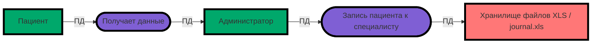

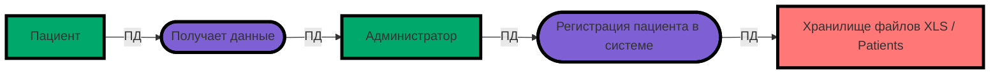

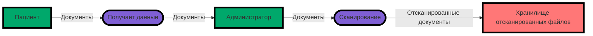

```mermaid
flowchart LR
    classDef action fill:#7F5FD4, stroke:#000, stroke-width:4px
    classDef entity fill:#00A86B, stroke:#000, stroke-width:4px
    classDef share fill:#FF7777 , stroke:#000, stroke-width:4px
    pacient[Пациент]:::entity
    admin[Администратор]:::entity
    xls_share[Хранилище файлов XLS]:::share
    register([Регистрация в системе]):::action
    get([Получает данные]):::action
    pacient--"Доп.данные"--> get--"Доп.данные"--> admin --"Доп.данные"--> register--"Доп.данные"-->xls_share    
```

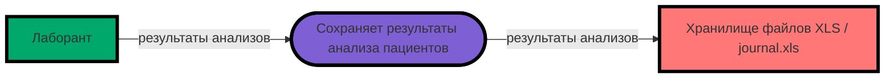

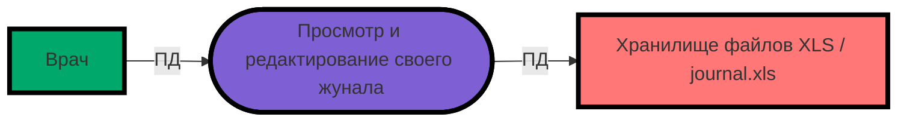

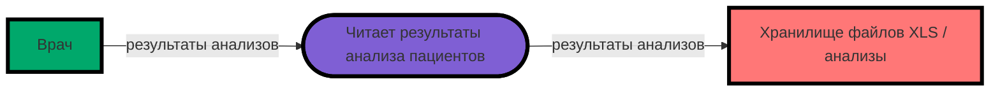

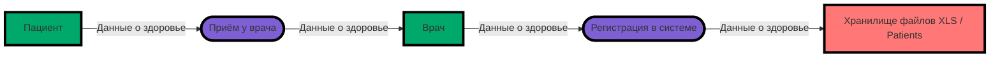

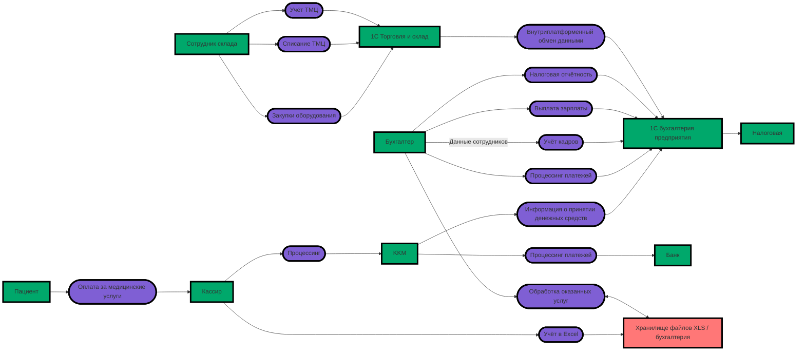


### 2. Аудит мер по обеспечению безопасности данных.

#### Сопоставление процессов с базовыми требованиями и практиками защиты конфиденциальных данных


| Процесс | Принцип / практика | Как есть сейчас | В чём суть проблемы | Связанный риск |
| --- | --- | --- | --- | --- |
| Запись и регистрация пациента | Минимизация персональных данных | Данные заносятся в Excel руками, также используются сканы и бумажные журналы | Отсутствует чёткий перечень обязательных полей для разных сценариев | Излишний сбор и неконтролируемое распространение ПДн |
| Запись и регистрация пациента | Принцип наименьших привилегий | Доступ в основном определяется членством в домене | Нет ограничений по ролям и функциям на уровне записей | Сотрудники видят информацию сверх служебной необходимости |
| Запись и регистрация пациента | Подотчётность действий | Операции в Excel и сетевых папках не фиксируются как события | Невозможно отследить, кто открывал или копировал данные пациента | Скрытые утечки и затруднённое расследование инцидентов |
| Медицинские записи | Разделение по сферам | Карты, снимки и журналы хранятся вместе с административными файлами | Клиническая информация не отделена от управленческой | Риск разглашения врачебной тайны через смежные процессы |
| Медицинские записи | Шифрование при хранении | Данные сохраняются на общем диске в открытом виде | Отсутствует управляемое шифрование на уровне полей или объектов | При компрометации сервера становится доступен весь массив |
| Медицинские записи | Доступ по связи с пациентом | Врачи и прочий персонал не привязаны к конкретному лечебному случаю | Не применяется ABAC на основе атрибутов (лечащий врач, филиал, статус приёма) | Возможен просмотр чужих амбулаторных карт и данных |
| Медицинские записи | Сроки хранения и удаление | Отсутствует централизованное управление сроками и процедурой удаления | Запрос пациента на прекращение обработки нельзя выполнить контролируемо | Нарушается жизненный цикл обработки сведений |
| Платежи | Разделение обязанностей | Кассир параллельно ведёт учёт в Excel и 1С | Ручное дублирование приводит к появлению лишних копий | Ошибки, расхождения, несанкционированные выгрузки |
| Платежи | Целевое использование | Платёжные и медицинские данные связаны по смыслу, но не разграничены логически | Отсутствует чёткая граница между биллингом и медконтуром | Медицинские данные излишне раскрываются в финансовых системах |
| Платежи | Безопасная интеграция | ККМ и 1С общаются через устаревший стек TCP/IP + OLE | Интеграция слабо управляется и плохо отслеживается | Накапливается технический и безопасностный долг |
| Лаборатория | Безопасный внешний обмен | Передача строится на файлах и реестрах | Нет API-контрактов с разрешённым перечнем полей и условий | Внешние системы могут получать лишние сведения |
| Лаборатория | Изоляция субъектов и клиентов | Нет гарантии, что пациент увидит только свои результаты | Отсутствуют идентификаторы для разграничения доступа | Риск раскрытия данных одного пациента другому |
| Лаборатория | Прослеживаемость данных | Не фиксируется состав переданных и полученных сведений | Невозможно доказать источник данных и их маршрут | Затруднён контроль вторичного использования |
| Отчётность и аналитика | Обезличивание по умолчанию | Аналитики работают с исходными Excel, Jupyter и Python-скриптами | Этап обезличивания не интегрирован в процесс | BI и ML-модели получают избыточные персональные данные |
| Отчётность и аналитика | Управляемый доступ | Отсутствует каталог данных, метки и назначенные владельцы дата-витрин | Нет автоматической проверки правомерности доступа | Растёт число неконтролируемых дублей данных |
| Вся инфраструктура | Эшелонированная защита | Один локальный сервер выполняет множество разных ролей | Не выполнена сегментация контуров и зон доверия | Широкий масштаб поражения при взломе |
| Вся инфраструктура | Мониторинг и оповещение | Отсутствует системный аудит обращений к чувствительной информации | Аномалии и массовые скачивания остаются без внимания | Инциденты выявляются с большим опозданием |


#### Список проблемных зон:
* Отсутствие шифрования: конфиденциальные сведения хранятся в незащищенном формате.
* Избыточные права доступа: отсутствует разграничение полномочий, файлы открыты для всего персонала.
* Отсутствие логирования: невозможно отследить историю просмотров и изменений.
* Незащищенные каналы связи: обмен информацией происходит по открытым протоколам.
* Отсутствие сегментации: медицинские, финансовые и складские блоки объединены в общую базу.
* Человеческий фактор: ручные методы обработки повышают вероятность операционных сбоев.
* Угроза безвозвратной потери: регулярное создание резервных копий (бэкапов) не настроено.


### 3. Что можно улучшить
#### Меры по обеспечению защиты информации:

Для разных категорий данных применяются соответствующие механизмы защиты:

- **Персональные данные (PII):** используются алгоритмы шифрования AES-256, защищённый канал TLS 1.3, а также процедура обезличивания при передаче в аналитические системы.
- **Медицинские сведения (СПДн):** защищаются с помощью AES-256, ролевой модели доступа (RBAC) и маскировки чувствительных полей.
- **Финансовая информация:** шифруется, а в журналах логирования подвергается обфускации (скрытию значимых частей).
- **Пароли пользователей:** хранятся в захэшированном виде через bcrypt, для входа требуется многофакторная аутентификация (MFA).

#### Механизм тегирования:

Внедряется система тегов для автоматической категоризации информации:

- `pii::personal::registration` — данные, относящиеся к регистрации физического лица;
- `spdn::health::diagnosis` — сведения о диагнозах и состоянии здоровья;
- `financial::contract::billing` — информация по договорам и биллингу.

Присвоенные метки позволяют автоматизировать управление доступом и отслеживать использование данных в системах.

#### Применяемые инструменты и технологии:

В части инфраструктуры:
- диски шифруются средствами BitLocker или LUKS;
- все сетевые соединения работают по протоколу TLS 1.3;
- для хранения секретов и ключей используется HashiCorp Vault.

На уровне баз данных:
- задействуется шифрование полей; (Если 1С использует PostgreSQL, то используем pgcrypto)
- информация разносится по отдельным схемам;
- события аудита собираются через Elasticsearch.

В организационных процессах:
- в CI/CD-конвейеры встроены сканеры уязвимостей (подход DevSecOps);
- учёт согласий пациентов ведётся в CRM-системе;
- организуется регулярное резервное копирование всех значимых массивов данных.

#### Доработайте диаграммы из предыдущего шага: отобразите на них, что следует использовать на каждом этапе потока.
Похоже, что использование mermaid для DFD было не лучшим решением, но попробую отрисовать на нём этот пункт.  


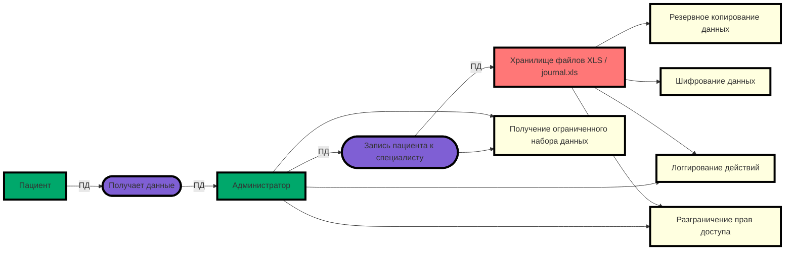

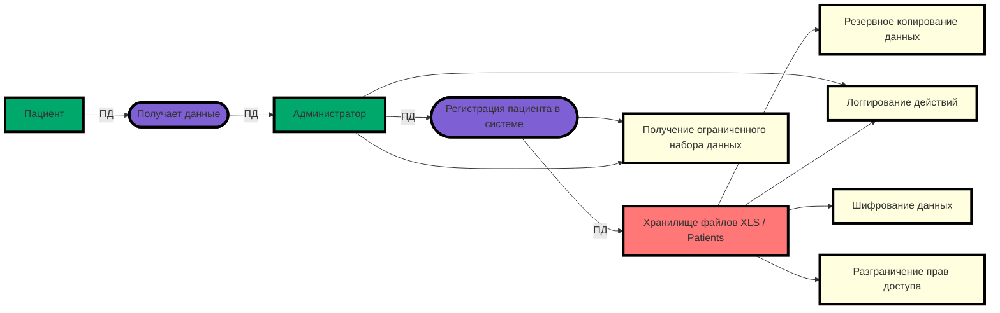

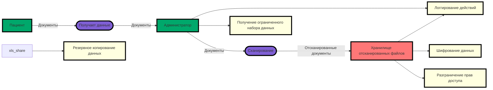

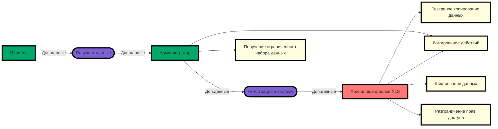

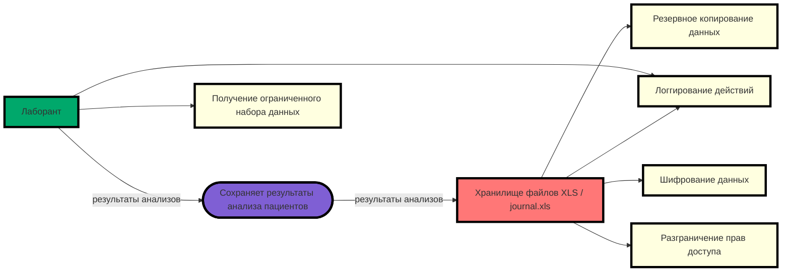

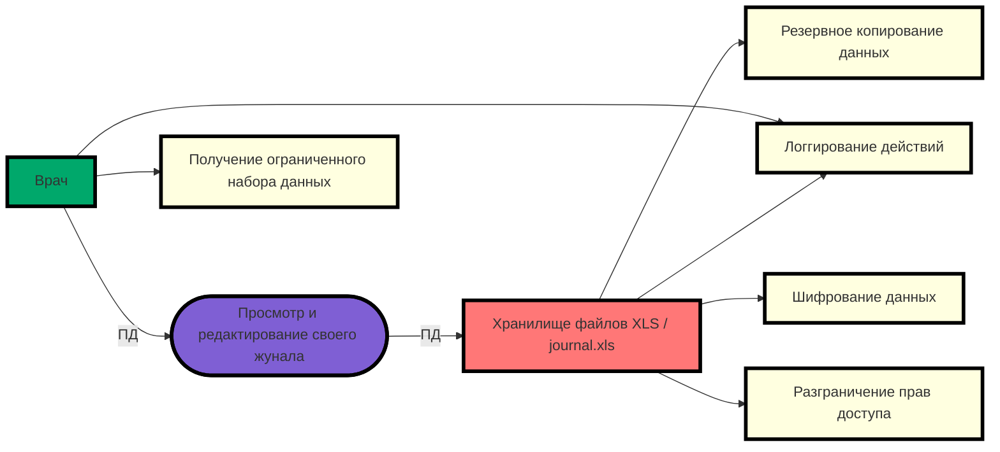

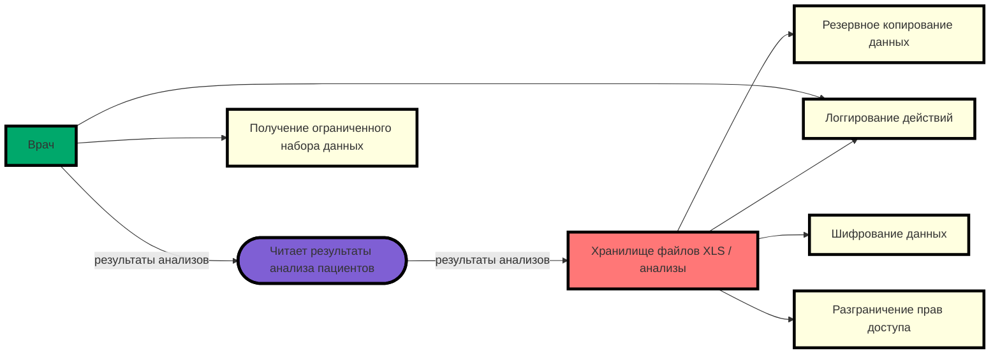

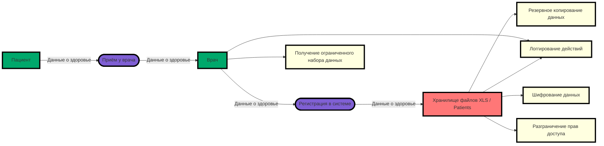

```mermaid
flowchart LR
    classDef action fill:#7F5FD4, stroke:#000, stroke-width:4px
    classDef entity fill:#00A86B, stroke:#000, stroke-width:4px
    classDef share fill:#FF7777 , stroke:#000, stroke-width:4px

    pacient[Пациент]:::entity
    1c_ent[1C бухгалтерия предприятия]:::entity
    1c_wh[1C Торговля и склад]:::entity
    edit([Учёт в Excel]):::action
    pay([Оплата за медицинские услуги]):::action
    info([Информация о принятии денежных средств]):::action
    processing([Процессинг]):::action
    processing_acc([Процессинг платежей]):::action
    processing_bank([Процессинг платежей]):::action
    hr_acc([Учёт кадров]):::action
    salary_acc([Выплата зарплаты]):::action
    acc_tax([Налоговая отчётность]):::action
    acc_handy([Обработка оказанных услуг]):::action
    1c_exchange([Внутриплатформенный обмен данными]):::action
    wh_in([Закупки оборудования]):::action
    wh_out([Списание ТМЦ]):::action
    wh_control([Учёт ТМЦ]):::action
    cashier[Кассир]:::entity
    bank[Банк]:::entity
    kkm[KKM]:::entity
    tax_services[Налоговая]:::entity
    xls_share[Хранилище файлов XLS / бухгалтерия]:::share
    accountant[Бухгалтер]:::entity
    wh_worker[Сотрудник склада]:::entity
    pacient-->pay-->cashier--> edit-->xls_share
    cashier-->processing-->kkm-->info-->1c_ent
    accountant-->processing_acc-->1c_ent
    accountant--"Данные сотрудников"-->hr_acc-->1c_ent
    accountant-->salary_acc-->1c_ent
    accountant-->acc_tax-->1c_ent
    accountant-->acc_handy<-->xls_share
    wh_worker-->wh_in-->1c_wh
    wh_worker-->wh_out-->1c_wh
    wh_worker-->wh_control-->1c_wh
    1c_wh-->1c_exchange-->1c_ent
    kkm-->processing_bank-->bank
    1c_ent-->tax_services


    classDef restriction fill:#FFFFE0 , stroke:#000, stroke-width:4px
    crypt[Шифрование данных]:::restriction    
    limit[Получение ограниченного набора данных]:::restriction
    rbac[Разграничение прав доступа]:::restriction
    logging[Логгирование действий]:::restriction
    backup[Резервное копирование данных]:::restriction
    xls_share-->backup
    1c_ent->crypt
    1c_ent->backup
    accountant-->logging
    wh_worker-->logging
    cashier-->logging
    xls_share-->logging    
    xls_share-->crypt    
    xls_share-->rbac
    1c_exchange-->crypt
```
