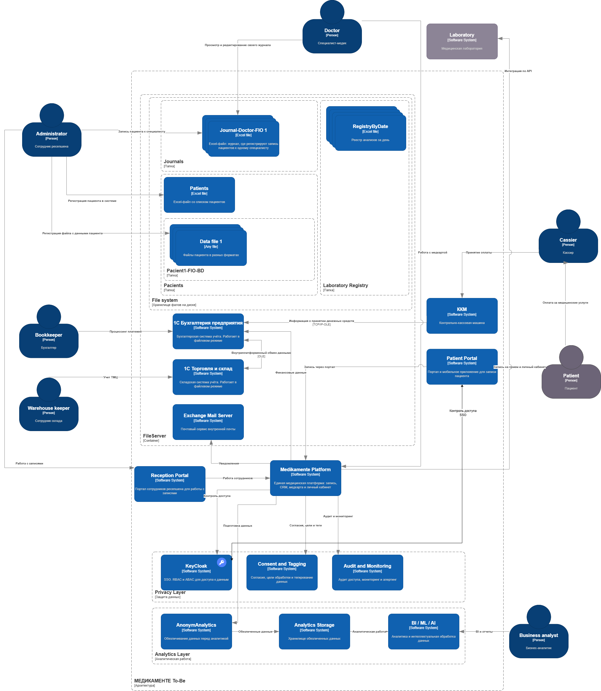

## Проектирование решения

Используя подход Privacy by Design, проведите анализ и предложите механизмы для предупреждения возможных рисков, связанных с конфиденциальностью. Ваша задача — спроектировать механизмы управления такими рисками до момента реализации изменений в проектируемой системе.
В рамках этого задания вам нужно проанализировать состояние As-Is и оценить, как спроектировать решение с учётом требований To-Be.
### Что нужно сделать
* Предложить новые блоки в архитектуру проектируемой системе С4, которые обеспечат соблюдение принципов Privacy By Design во многих блоках реализуемой системы.
* Предложить в целевой архитектуре слой, который обеспечивает аналитическую работу с данными системы с учётом принципов Privacy by Design.
Когда задание будет готово, загрузите диаграмму контекста C4 целевого состояния системы в директорию Task2 в рамках пул-реквеста.

Вот переформулировка вашего текста с сохранением смысла, но другими словами:

---

# Задание 2. Разработка архитектурного решения

## Что было выполнено

Базой послужила исходная C4-диаграмма, данная в условии задачи. В неё были внесены дополнения в виде новых компонентов, реализующих принципы Privacy by Design, при этом общая структура существующего ландшафта осталась неизменной.

В целевой версии архитектуры сохранены все прежние действующие лица и системы:

- пациент;
- администратор;
- врач;
- кассир;
- бухгалтер;
- работник склада;
- система «1С»;
- контрольно-кассовая машина (ККМ);
- сторонняя лаборатория.

На этой основе добавлены следующие новые элементы:

1. **Medikamente Platform** (медицинская платформа);
2. **Reception Portal** (портал для регистратуры);
3. **Patient Portal** (портал для пациентов);
4. **Privacy Layer** (уровень защиты данных);
5. **Analytics Layer** (аналитический уровень).

## Краткое описание новых компонентов

### Medikamente Platform

Представляет собой внутреннее ядро системы, где сосредоточены функции по управлению записями на приём, хранению медицинской информации, обработке лабораторных результатов и обмену данными между внутренними подсистемами.

### Patient Portal

Предназначен для взаимодействия с пациентом через цифровой канал связи, что исключает передачу информации по телефону, через файлы и ручной ввод данных.

### Reception Portal

Создан для сотрудников регистратуры с целью отказаться от рутинной работы с электронными таблицами и локальными файлами в пользу централизованной системы.

### Privacy Layer

На этом уровне сконцентрированы ключевые механизмы обеспечения конфиденциальности:

- **KeyCloak. SSO/Access Control** — управление доступом;
- **Consent and Tagging** — учёт согласий и маркировка данных;
- **Audit and Monitoring** — аудит и мониторинг действий.

Смысл выделения этого слоя в том, что защита данных реализуется не отдельными точечными решениями, а в виде общей архитектурной практики, пронизывающей всю систему.

### Analytics Layer

Включает в себя три основных компонента:

- **AnonymAnalytics ** — обезличивание данных для аналитики;
- **Analytics Storage** — хранилище для аналитических данных;
- **BI / ML / AI** — инструменты бизнес-аналитики, машинного обучения и искусственного интеллекта.

Это подчёркивает, что аналитика работает не с сырыми персональными данными, а с предварительно обработанными и обезличенными наборами.

## Обоснование соответствия принципам Privacy by Design

1. Управление доступом закладывается в архитектуру на этапе проектирования, а не достраивается позже.
2. Механизмы учёта согласий и тегирования встроены непосредственно в процессы обработки информации.
3. Аналитический контур изолирован от операционного, что снижает риски.
4. Для всех аналитических задач используется процедура обезличивания данных.
5. Обеспечивается полная отслеживаемость доступа к данным и всех пользовательских действий через средства аудита и мониторинга.

Основная схема представлена в файле: [c4-context.drawio](./c4-context.drawio)  
  
