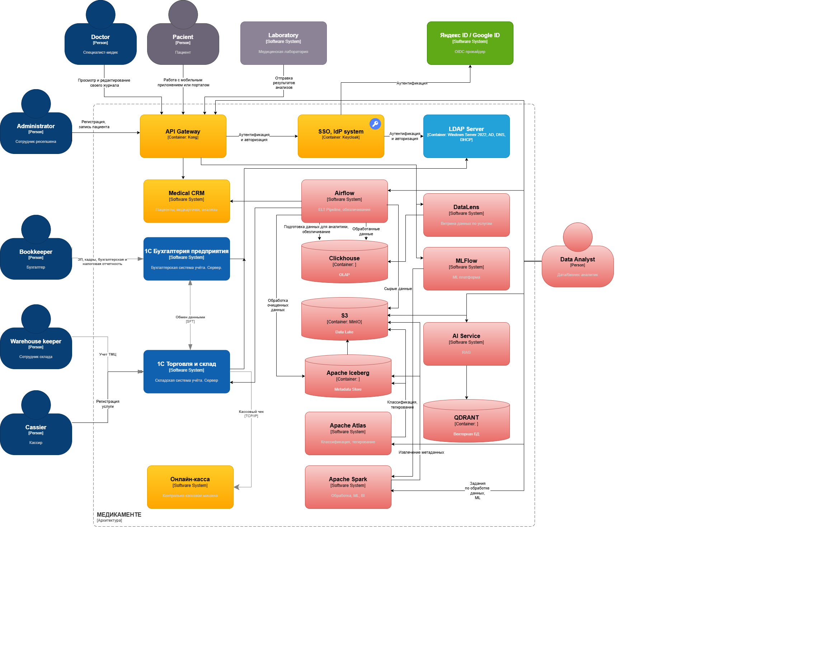

# Задание 2. Разработка архитектурного решения

## Что было выполнено

Базой послужила исходная C4-диаграмма, данная в условии задачи. В неё были внесены дополнения в виде новых компонентов, реализующих принципы Privacy by Design, при этом общая структура существующего ландшафта осталась неизменной.

В целевой версии архитектуры сохранены все прежние действующие лица и системы:

- пациент;
- администратор;
- врач;
- кассир;
- бухгалтер;
- работник склада;
- система «1С»;
- контрольно-кассовая машина (ККМ);
- сторонняя лаборатория.

На этой основе добавлены следующие новые элементы:

1. **Medikamente Platform** (медицинская платформа);
2. **Reception Portal** (портал для регистратуры);
3. **Patient Portal** (портал для пациентов);
4. **Privacy Layer** (уровень защиты данных);
5. **Analytics Layer** (аналитический уровень).

## Краткое описание новых компонентов

### Medikamente Platform

Представляет собой внутреннее ядро системы, где сосредоточены функции по управлению записями на приём, хранению медицинской информации, обработке лабораторных результатов и обмену данными между внутренними подсистемами.

### Patient Portal

Предназначен для взаимодействия с пациентом через цифровой канал связи, что исключает передачу информации по телефону, через файлы и ручной ввод данных.

### Reception Portal

Создан для сотрудников регистратуры с целью отказаться от рутинной работы с электронными таблицами и локальными файлами в пользу централизованной системы.

### Privacy Layer

На этом уровне сконцентрированы ключевые механизмы обеспечения конфиденциальности:

- **KeyCloak. SSO/Access Control** — управление доступом;
- **Consent and Tagging** — учёт согласий и маркировка данных;
- **Audit and Monitoring** — аудит и мониторинг действий.

Смысл выделения этого слоя в том, что защита данных реализуется не отдельными точечными решениями, а в виде общей архитектурной практики, пронизывающей всю систему.

### Analytics Layer

Включает в себя три основных компонента:

- **AnonymAnalytics** — обезличивание данных для аналитики;
- **Analytics Storage** — хранилище для аналитических данных;
- **BI / ML / AI** — инструменты бизнес-аналитики, машинного обучения и искусственного интеллекта.

Это подчёркивает, что аналитика работает не с сырыми персональными данными, а с предварительно обработанными и обезличенными наборами.

## Обоснование соответствия принципам Privacy by Design

1. Управление доступом закладывается в архитектуру на этапе проектирования, а не достраивается позже.
2. Механизмы учёта согласий и тегирования встроены непосредственно в процессы обработки информации.
3. Аналитический контур изолирован от операционного, что снижает риски.
4. Для всех аналитических задач используется процедура обезличивания данных.
5. Обеспечивается полная отслеживаемость доступа к данным и всех пользовательских действий через средства аудита и мониторинга.

Основная схема представлена в файле: [c4-context.drawio](./c4-context.drawio)  
  

## Размышления на тему задания
`Предложить новые блоки в архитектуру проектируемой системе С4, которые обеспечат соблюдение принципов Privacy By Design во многих блоках реализуемой системы.`  
Получается, что новые блоки соответствуют PbD, а старые нет.  
В результате, кмк нарушаются следюущие принципы Privacy by Design:
* Конфиденциальность по умолчанию
* Конфиденциальность, заложенная в дизайн
* Полная функциональность без компромиссов  

И сам подход предполагает сначала спроектировать PbD, а потом сделать. А у нас уже всё сделано, а после этого добавляем блоки, которые соответствуют PbD.

Поэтому добавлю в решение еще схему, в которой старые блоки будут заменены на новые.  
Также попробую применить новые знания по Data Lineage.  

Из старых компонентов останутся:
* 1С:Бухгалтерия предприятия
* 1С:Торговля и склад
* Microsoft Windows Server 2022 + Active Directory, DNS, DHCP, LDAP

Новые компоненты(жёлтым цветом на схеме), изменяющие предыдущие бизнес-компоненты:
* Medical CRM
* API Gateway
* Онлайн-касса
* SSO/IdP с интеграцией с AD и внешними системами(Google/Yandex)

Новые компоненты для BI/ML/DataLineage(розовым цветом на схеме):

* Для Data Lineage(отслеживание происхождения) будем использовать Apache Atlas.
* Также Apache Atlas закроет задачи каталогизации и тегирования.
* Для работы с данными для ML будем использовать Apache Spark
* ABAC/RBAC, аутентификация, авторизация - за это будет отвечать Keycloak, интегрированный с имеющимся Win AD.

Используемые компоненты и их назначение

MinIO и Apache Iceberg выступают в роли озера данных (Data Lake). На первом этапе сюда загружаются необработанные данные, затем они последовательно проходят несколько стадий преобразования. Промежуточные результаты обработки также сохраняются в этом же хранилище, а финальные, полностью подготовленные данные передаются в ClickHouse. Доступ к ним аналитики получают через специализированные витрины данных.

Airflow отвечает за оркестрацию следующих процессов:
* загрузка данных из CRM-системы в сыром виде в рамках ELT-подхода с последующей обработкой, при этом на этапе загрузки данные обезличиваются;
* прямая загрузка информации из «1С» и CRM в ClickHouse с одновременной обработкой данных по услугам;
* загрузка очищенных и размеченных тегами данных (с использованием Apache Spark и Atlas) в ClickHouse.

Apache Spark применяется для двух основных задач:
* очистка и предварительная обработка сырых данных, по итогам которых формируется метаданная база Iceberg;
* машинное обучение с применением библиотеки MLLib, при этом обученная модель также сохраняется в Data Lake.
* Apache Atlas служит для классификации и нанесения тегов на данные. В качестве альтернативы можно рассмотреть Informatica BDE (Big Data Edition) — этот продукт позволяет отслеживать происхождение данных (Data Lineage), однако он является платным и имеет достаточно высокую стоимость.

AI Service и QDRANT представляют собой систему, реализующую подход RAG (Retrieval-Augmented Generation) на основе данных из озера и обученной ML-модели. Данные проходят векторизацию и сохраняются в векторной базе данных QDRANT.

DataLens используется как витрина данных. Для более сложной и углублённой аналитики возможно применение платформы MLFlow.

`Privacy by design` схема представлена в файле: [task2_pbd_to_be.drawio](./task2_pbd_to_be.drawio)  

