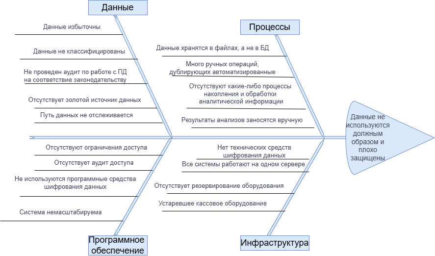

# Задание 4. Оценка узких мест при миграции

## Задачи миграции

1. Реализовать обмен с лабораторией через API.
2. Развить направление обработки данных(ML,BI,аналитика)
3. Создать ряд новых систем:
    - клиентский портал;
    - портал для сотрудников регистратуры;
    - платёжный шлюз;
    - CRM для аккумуляции информации о клиентах;
    - интеграционный интерфейс с лабораторной службой.
4. Выпустить мобильное приложение.
5. Внедрить систему классификации и маркировки данных.
6. После каждого релиза в автоматическом режиме проверять корректность работы с размеченными данными, затем передавать результаты в подсистему мониторинга и оповещений.
7. Обеспечить возможность аудита обращений к данным и выявления аномального поведения пользователей; при обнаружении несанкционированного доступа направлять уведомления ответственной команде.

## Основные процессы и системы, которые затронет переход

### Бизнес-процессы

1. Регистрация пациента в системе.
2. Запись пациента на приём.
3. Предоставление медицинской услуги.
4. Расчёт и приём оплаты за услугу:
    - формирование фискального чека;
    - оплата наличными средствами;
    - безналичное перечисление.
5. Фиксация результатов лабораторных анализов.
6. Учёт оказанных услуг.
7. Ведение кадрового учёта.
8. Расчёт заработной платы сотрудников.
9. Подготовка и сдача налоговой отчётности.

### ИТ-компоненты

1. Файловое хранилище (сетевой диск).
2. «1С: Бухгалтерия».
3. «1С: Торговля».
4. Контрольно-кассовая машина (ККМ).

## Диаграмма Исикавы

Для наглядного выявления проблемных мест предлагается использовать диаграмму Исикавы:  
  
[Диаграмма Исикавы](./fishbone.drawio)  

## План действий по устранению узких мест

**В области данных:**

1. Руководствоваться принципом Privacy by Design.
2. Собирать только необходимый минимум данных.
3. Проводить классификацию информации по категориям.
4. Применять готовые сертифицированные решения, отвечающие требованиям 152-ФЗ (например, продукты «1С»).
5. Сформировать единый достоверный источник данных (золотой источник).
6. Внедрить тегирование, а также использовать инструменты, позволяющие отслеживать маршрут и преобразования данных.
7. Применять обфускацию и обезличивание там, где это оправдано.

**В области процессов:**

1. Перейти на хранение данных в реляционных базах данных.
2. Внедрить CRM для исключения ручного ввода и операций.
3. Организовать процессы накопления и обработки аналитики.
4. Включить ML и AI в аналитический конвейер.
5. Настроить интеграцию с лабораторией.

**В области программного обеспечения:**

1. Реализовать ролевую или атрибутную модель доступа к данным.
2. Организовать логирование всех обращений к данным.
3. Шифровать информацию как при хранении, так и при передаче.
4. Заложить масштабируемость в архитектуру решений.
5. Перевести «1С» с файлового режима на клиент-серверный.

**В области инфраструктуры:**

1. Использовать шифровальные средства.
2. Выделить отдельные серверы под различные функции.
3. Предусмотреть резервирование оборудования.
4. Обновить ККМ до современных моделей с функцией онлайн-передачи данных.

## Приоритеты выполнения работ

Очерёдность соответствует перечисленному порядку:

1. На первом месте — работа с данными (включая Privacy by Design).
2. Затем проектирование безопасных и эффективных процессов.
3. Далее — разработка ПО в соответствии со спроектированными процессами (без учёта аналитического направления).
4. После этого — модернизация инфраструктуры (оборудование можно закупать на этапе, близком к приёмочным испытаниям).
5. В последнюю очередь — развёртывание направления обработки данных, поскольку оно требует значительных затрат на вычислительные ресурсы, финансы и кадры.